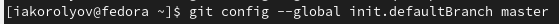

---
## Front matter
title: "Jтчёт по лабораторной работе №3"
author: "Королёв Иван Андреевич"

## Generic otions
lang: ru-RU
toc-title: "Содержание"

## Bibliography
bibliography: bib/cite.bib
csl: pandoc/csl/gost-r-7-0-5-2008-numeric.csl

## Pdf output format
toc: true # Table of contents
toc-depth: 2
lof: true # List of figures
lot: true # List of tables
fontsize: 12pt
linestretch: 1.5
papersize: a4
documentclass: scrreprt
## I18n polyglossia
polyglossia-lang:
  name: russian
  options:
	- spelling=modern
	- babelshorthands=true
polyglossia-otherlangs:
  name: english
## I18n babel
babel-lang: russian
babel-otherlangs: english
## Fonts
mainfont: PT Serif
romanfont: PT Serif
sansfont: PT Sans
monofont: PT Mono
mainfontoptions: Ligatures=TeX
romanfontoptions: Ligatures=TeX
sansfontoptions: Ligatures=TeX,Scale=MatchLowercase
monofontoptions: Scale=MatchLowercase,Scale=0.9
## Biblatex
biblatex: true
biblio-style: "gost-numeric"
biblatexoptions:
  - parentracker=true
  - backend=biber
  - hyperref=auto
  - language=auto
  - autolang=other*
  - citestyle=gost-numeric
## Pandoc-crossref LaTeX customization
figureTitle: "Рис."
tableTitle: "Таблица"
listingTitle: "Листинг"
lofTitle: "Список иллюстраций"
lotTitle: "Список таблиц"
lolTitle: "Листинги"
## Misc options
indent: true
header-includes:
  - \usepackage{indentfirst}
  - \usepackage{float} # keep figures where there are in the text
  - \floatplacement{figure}{H} # keep figures where there are in the text
---

# Цель работы
Целью работы является изучить идеологию и применение средств контроля версий. Приобрести практические навыки по работе с системой git.
# Задание
Необходимо зарегестрироваться на GitHub. Сделать базовые настройки,создать SSH-ключ, создать рабочее пространоство и рупозиторий курса и настроить каталог курса
# Теоретическое введение
1. Системы контроля версий. Общие понятия: Системы контроля версий (Version Control System, VCS) применяются при работе нескольких человек над одним проектом. Обычно основное дерево проекта хранится в локальном или удалённом репозитории, к которому настроен доступ для участников проекта. При внесении изменений в содержание проекта система контроля версий позволяет их фиксировать, совмещать изменения, произведённые разными участниками проекта, производить откат к любой более ранней версии проекта, если это требуется.В классических системах контроля версий используется централизованная модель, предполагающая наличие единого репозитория для хранения файлов. Выполнение большинства функций по управлению версиями осуществляется специальным сервером. Участник проекта (пользователь) перед началом работы посредством определённых команд получает нужную ему версию файлов. После внесения изменений, пользователь размещает новую версию в хранилище. При этом предыдущие версии не удаляются из центрального хранилища и к ним можно вернуться в любой момент. Сервер может сохранять не полную версию изменённых файлов, а производить так называемую дельта-компрессию — сохранять только изменения между последовательными версиями, что позволяет уменьшить объём хранимых данных.Системы контроля версий поддерживают возможность отслеживания и разрешения конфликтов, которые могут возникнуть при работе нескольких человек над одним файлом. Можно объединить (слить) изменения, сделанные разными участниками (автоматически или вручную), вручную выбрать нужную версию, отменить изменения вовсе или заблокировать файлы для изменения. В зависимости от настроек блокировка не позволяет другим пользователям получить рабочую копию или препятствует изменению рабочей копии файла средствами файловой системы ОС, обеспечивая таким образом, привилегированный доступ только одному пользователю, работающему с файлом.Системы контроля версий также могут обеспечивать дополнительные, более гибкие функциональные возможности. Например, они могут поддерживать работу с несколькими версиями одного файла, сохраняя общую историю изменений до точки ветвления версий и собственные истории изменений каждой ветви. Кроме того, обычно доступна информация о том, кто из участников, когда и какие изменения вносил. Обычно такого рода информация хранится в журнале изменений, доступ к которому можно ограничить.В отличие от классических, в распределённых системах контроля версий центральный репозиторий не является обязательным.Среди классических VCS наиболее известны CVS, Subversion, а среди распределённых — Git, Bazaar, Mercurial. Принципы их работы схожи, отличаются они в основном синтаксисом используемых в работе команд.
2. Система контроля версий Git: Система контроля версий Git представляет собой набор программ командной строки. Доступ к ним можно получить из терминала посредством ввода команды git с различными опциями. Благодаря тому, что Git является распределённой системой контроля версий, резервную копию локального хранилища можно сделать простым копированием или архивацией. 

# Выполнение лабораторной работы
## Настройка GitHub:
Создаю учетную запись на GitHub и заполняюю основные данные(рис.1 [-@fig:1])

{ #fig:fig1 width=70% }

## Базовая настройка git: 
Сначала сделаю предварительную конфигурацию git. Открою терминал и введу следующие команды, указав имя и email(рис.2 [-@fig:2])

{ #fig:fig2 width=70% }

Настрою utf-8 в выводе сообщений git(рис.3 [-@fig:3])

{ #fig:fig3 width=70% }

Задам имя начальной ветки(рис.4 [-@fig:4])

{ #fig:fig4 width=70% }

Параметр autocrlf(рис.5 [-@fig:5])

{ #fig:fig5 width=70% }

Параметр safecrlf(рис.6 [-@fig:6])

{ #fig:fig6 width=70% }

## Создание SSH-ключа: 

Для  последующей  идентификации  пользователя  на  сервере  репозиториев необходимо сгенерировать пару ключей (приватный и открытый)(рис.7 [-@fig:7])

{ #fig:fig7 width=70% }

Ключи сохраняться в каталоге ~/.ssh/.
Далее необходимо загрузить сгенерённый открытый ключ. Для этого захожу на сайт github. Нажимаю на иконку своей  учетной записи и перехожу в Settings. Далее нажимаю SSH and GPG key, и нажимаю New Key()(рис.8 [-@fig:8])

{ #fig:fig8 width=70% }

Скопирую из локальной консоли ключ в буфер обмен с помощью команды(рис.9 [-@fig:9])

{ #fig:fig9 width=70% }

Вставляем  ключ  в  появившееся  на  сайте  поле  и  указываем  для  ключа  имя(gite)(рис.10 [-@fig:10])

{ #fig:fig10 width=70% }

## Создание рабочего пространства и репозитория курса на основе  шаблона:

Открою терминал и создам каталог для предмета «Архитектура компьютера»(рис.11 [-@fig:11])

{ #fig:fig11 width=70% }

## Создание репозитория курса на основе шаблона:

Репозиторий на основе шаблона можно создать через web-интерфейс github.
Перейду на станицу репозитория с шаблоном курса https://github.com/yam adharma/course-directory-student-template.
Далее выберу Use this template(рис.12 [-@fig:12])

{ #fig:fig12 width=70% }

В открывшемся окне задаю имя репозитория (Repository name) study_2022–2023_arh-pc и создаю репозиторий (кнопка Create repository from template).
Открою терминал и перейду в каталог(рис.13 [-@fig:13])

{ #fig:fig13 width=70% }

Клонирую созданный репозиторий(рис.14 [-@fig:14])

{ #fig:fig14 width=70% }

## Настройка каталога курса:

Перейду в каталог курса(рис.15 [-@fig:15])

{ #fig:fig15 width=70% }

Удалю лишние файлы,cоздам необходимые каталоги(рис.16 [-@fig:16])

{ #fig:fig16 width=70% }

Отправлю файлы на сервер(рис.17 [-@fig:17])

{ #fig:fig17 width=70% }

Проверю правильность создания иерархии рабочего пространства в локальном репозитории и на странице github(рис.18 [-@fig:18])

{ #fig:fig18 width=70% }

# Выполнение самостоятельной работы:

Загружу все отчеты по выполненым работам в каталоги рабочего пространства(labs>lab01>report), и так для каждой лабораторной работы.(рис.19 [-@fig:19]),(рис.20 [-@fig:20]),(рис.21 [-@fig:21])

{ #fig:fig19 width=70% }

{ #fig:fig20 width=70% }

{ #fig:fig21 width=70% }

Такие действия, я проделываю для каждой лабораторной работы, загружаю все на github.
Моя ссылка на репозиторий: https://github.com/iakorolev/study_2022-2023_arh-pc

# Выводы

Я изучил идеологию и применение средств контроля версий. Приобрел практические навыки по работе с системой git.

