---
## Front matter
title: "Отчёт по лабораторной работе №5"
author: "Королёв Иван Андреевич"

## Generic otions
lang: ru-RU
toc-title: "Содержание"

## Bibliography
bibliography: bib/cite.bib
csl: pandoc/csl/gost-r-7-0-5-2008-numeric.csl

## Pdf output format
toc: true # Table of contents
toc-depth: 2
lof: true # List of figures
lot: true # List of tables
fontsize: 12pt
linestretch: 1.5
papersize: a4
documentclass: scrreprt
## I18n polyglossia
polyglossia-lang:
  name: russian
  options:
	- spelling=modern
	- babelshorthands=true
polyglossia-otherlangs:
  name: english
## I18n babel
babel-lang: russian
babel-otherlangs: english
## Fonts
mainfont: PT Serif
romanfont: PT Serif
sansfont: PT Sans
monofont: PT Mono
mainfontoptions: Ligatures=TeX
romanfontoptions: Ligatures=TeX
sansfontoptions: Ligatures=TeX,Scale=MatchLowercase
monofontoptions: Scale=MatchLowercase,Scale=0.9
## Biblatex
biblatex: true
biblio-style: "gost-numeric"
biblatexoptions:
  - parentracker=true
  - backend=biber
  - hyperref=auto
  - language=auto
  - autolang=other*
  - citestyle=gost-numeric
## Pandoc-crossref LaTeX customization
figureTitle: "Рис."
tableTitle: "Таблица"
listingTitle: "Листинг"
lofTitle: "Список иллюстраций"
lotTitle: "Список таблиц"
lolTitle: "Листинги"
## Misc options
indent: true
header-includes:
  - \usepackage{indentfirst}
  - \usepackage{float} # keep figures where there are in the text
  - \floatplacement{figure}{H} # keep figures where there are in the text
---

# Цель работы

Освоение процедуры компиляции и сборки программ, написанных на ассемблере NASM.

# Задание

Необходимо будет написать программу Hello,world!. ОТтранслировать и скомпоновать её.

# Теоретическое введение

1. Основные принципы работы компьютера

Основнымифункциональнымиэлементамилюбойэлектронно-вычислительной машины (ЭВМ) являются центральный процессор, память и периферийные устройства.
Взаимодействие этих устройств осуществляется через общую шину,к которой они подключены.Физически шина представляетсобой большое количество проводников,соединяющих
устройства друг с другом.В современных компьютерах проводники выполнены в виде электропроводящих дорожек на материнской (системной) плате.

Основной задачей процессора является обработка информации, а также орга- низация координации всех узлов компьютера. В состав центрального процес- сора (ЦП) входят следующие устройства:
* арифметико-логическое устройство (АЛУ) — выполняет логические и арифметические действия, необходимые для обработки информации, хранящейся в памяти; 
* устройство управления (УУ)—обеспечиваетуправление и контроль всех устройств компьютера; 
* регистры — сверхбыстрая оперативная память небольшого объёма, вхо- дящая в состав процессора, для временного хранения промежуточных результатов выполнения инструкций; регистры процессора делятся на два типа: регистры общего назначения и специальные регистры.

Для того, чтобы писать программы на ассемблере, необходимо знать, какие регистры процессора существуют и как их можно использовать. Большинство команд в программах написанных на ассемблере используют регистры в каче- стве операндов. Практически все команды представляют собой преобразование данных хранящихся в регистрах процессора, это например пересылка данных между регистрами или между регистрами и памятью, преобразование (арифме- тические или логические операции) данных хранящихся в регистрах. Доступ к регистрам осуществляется не по адресам, как к основной памяти, а по именам. Каждый регистр процессора архитектуры x86 имеет свое название, состоящее из 2 или 3 букв латинского алфавита.
В качестве примера приведем названия основных регистров общего назначе- ния (именно эти регистры чаще всего используются при написании программ):
* RAX, RCX, RDX, RBX, RSI, RDI — 64-битные
* EAX, ECX, EDX, EBX, ESI, EDI — 32-битные
* AX, CX, DX, BX, SI, DI — 16-битные 
* AH, AL, CH, CL, DH, DL, BH, BL — 8-битные (половинки 16-битных реги- стров).Например,AH (high AX)—старшие 8 бит регистра AX,AL (low AX)— младшие 8 бит регистра AX.

Таким образом можно отметить, что вы можете написать в своей программе, например,такие команды (mov – команда пересылки данных на языке ассем- блера):
mov ax, 1
mov eax, 1

2. Ассемблер и язык ассемблера

Язык ассемблера (assembly language, сокращённо asm) — машинно- ориентированный язык низкого уровня. Можно считать, что он больше любых других языков приближен к архитектуре ЭВМ и её аппаратным возможностям, что позволяет получить к ним более полный доступ, нежели в языках высокого уровня,таких как C/C++,Perl,Python и пр.Заметим,что получитьполныйдоступ к ресурсам компьютера в современных архитектурах нельзя, самым низким уровнем работы прикладной программы является обращение напрямую к ядру операционной системы. Именно на этом уровне и работают программы, напи- санные на ассемблере. Но в отличие от языков высокого уровня ассемблерная программа содержиттолькотот код,который ввёл программист.Таким образом язык ассемблера — это язык, с помощью которого понятным для человека образом пишутся команды для процессора. Следует отметить, что процессор понимает не команды ассемблера, а после- довательности из нулей и единиц — машинные коды. До появления языков ассемблера программистам приходилось писать программы, используя только лишь машинные коды, которые были крайне сложны для запоминания,так как представляли собой числа, записанные в двоичной или шестнадцатеричной системе счисления. Преобразование или трансляция команд с языка ассембле- ра в исполняемый машинный код осуществляется специальной программой транслятором — Ассемблер. Программы,написанные на языке ассемблера,не уступаютв качестве и скоро- сти программам, написанным на машинном языке,так как транслятор просто переводит мнемонические обозначения команд в последовательности бит (ну- лей и единиц). Используемые мнемоники обычно одинаковы для всех процессоров одной архитектуры или семейства архитектур (среди широко известных—мнемоники процессоров и контроллеров x86,ARM, SPARC, PowerPC,M68k). Таким образом для каждой архитектуры существует свой ассемблер и, соответственно, свой язык ассемблера. Наиболее распространёнными ассемблерами для архитектуры x86 являются:
* для DOS/Windows: Borland Turbo Assembler (TASM), Microsoft Macro Assembler (MASM) и Watcom assembler (WASM); 
* для GNU/Linux: gas (GNU Assembler), использующий AT&T-синтаксис, в отличие от большинства других популярных ассемблеров,которые исполь- зуют Intel-синтаксис

NASM — это открытый проект ассемблера, версии которого доступны под различные операционные системы и который позволяет получать объектные файлыдляэтихсистем.ВNASMиспользуетсяIntel-синтаксисиподдерживаются инструкции x86-64

Здесь мнемокод — непосредственно мнемоника инструкции процессору, ко- торая является обязательной частью команды. Операндами могут быть числа, данные,адреса регистров или адреса оперативной памяти. Метка—это иденти- фикатор,с которым ассемблер ассоциирует некоторое число,чаще всего адрес в памяти. Т.о. метка перед командой связана с адресом данной команды.
Допустимыми символами в метках являются буквы, цифры, а также следую- щие символы: _, $, #, @,~,. и ?.
Начинаться метка или идентификатор могут с буквы, ., _ и ?. Перед иденти- фикаторами, которые пишутся как зарезервированные слова, нужно писать $, чтобы компилятор трактовал его верно (так называемое экранирование). Макси- мальная длина идентификатора 4095 символов.
Программа на языке ассемблера также может содержать директивы — ин- струкции, не переводящиеся непосредственно в машинные команды, а управ- ляющие работой транслятора. Например,директивы используются для опреде- ления данных (констант и переменных) и обычно пишутся большими буквами.

# Выполнение лабораторной работы

1. Программа Hello world!

Создаю каталог для работы с программами на языке ассемблера NASM(~/work/arch-pc/lab05).Перехожу в созданный каталог.

Создайте текстовый файл с именем hello.asm и открываю его с помощью текстового редактора gedit.([-@fig:1])([-@fig:2])

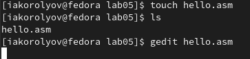{ #fig:1 width=70% }

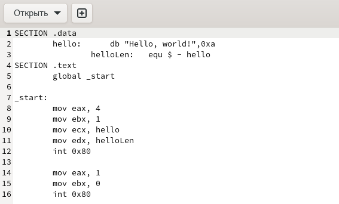{ #fig:2 width=70% }

2. Транслятор NASM

NASM превращает текст программы в объектный код .Например, для компиляции приведённого выше текста программы «Hello World» необходимо написать([-@fig:3])

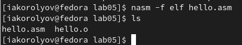{ #fig:3 width=70% }

Если текст программы набран без ошибок,то транслятор преобразуеттекст программы из файла hello.asm в объектный код, который запишется в файл hello.o. Таким образом, имена всех файлов получаются из имени входного файла и расширения по умолчанию. При наличии ошибок объектный файл не создаётся, а после запуска транслятора появятся сообщения об ошибках или предупреждения. С помощью команды ls проверьте, что объектный файл был создан. Какое имя имеет объектный файл? NASM не запускают без параметров. Ключ -f указываеттранслятору, что тре- буется создать бинарные файлы в формате ELF. Следует отметить, что формат elf64 позволяет создавать исполняемый код,работающий под 64-битными версиями Linux. Для 32-битных версий ОС указываем в качестве формата просто elf. NASM всегда создаёт выходные файлы в текущем каталоге.

3. Расширенный синтаксис командной строки NASM

Cкомпилирует исходный файл hello.asm с помощью команды: ([-@fig:4])

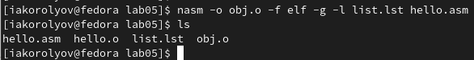{ #fig:4 width=70% }

Данная команда скомпилирует исходный файл hello.asm в obj.o (опция - o позволяет задать имя объектного файла, в данном случае obj.o), при этом формат выходного файла будет elf, и в него будут включены символы для отладки (опция -g), кроме того, будет создан файл листинга list.lst (опция -l).

4. Компоновщик LD

Чтобы получить исполняемую программу, объектный файл необходимо передать на обработку компоновщику: ([-@fig:5])

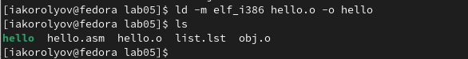{ #fig:5 width=70% }

Ключ -o с последующим значением задаёт в данном случае имя создаваемого исполняемого файла.([-@fig:6])

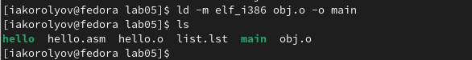{ #fig:6 width=70% }

5. Запуск исполняемого файла

Запуск исполняемого файла([-@fig:7)

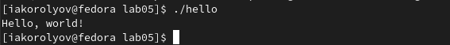{ #fig:7 width=70% }

# Задание для самостоятельной работы

1.  В каталоге ~/work/arch-pc/lab05 с помощью команды cp создаю копию файла hello.asm с именем lab5.asm.([-@fig:8])

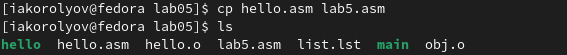{ #fig:8 width=70% }

2. С помощью любого текстового редактора вношу изменения в текст программы в файле lab5.asm так, чтобы вместо Hello world! на экран выводилась строка с моей фамилией и именем.([-@fig:9])

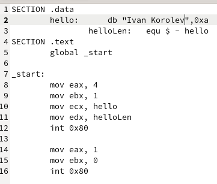{ #fig:9 width=70% }

3. Оттранслировал полученный текст программы lab5.asm в объектный файл. Выполнил компоновку объектного файла и запустил получившийся исполняемый файл.([-@fig:10])

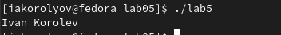{ #fig:10 width=70% }

4. Отправил все файлы на github.([-@fig:11])

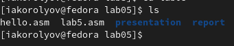{ #fig:11 width=70% }

# Выводы

Я освоил процедуры компиляции и сборки программ, написанных на ассемблере NASM.

