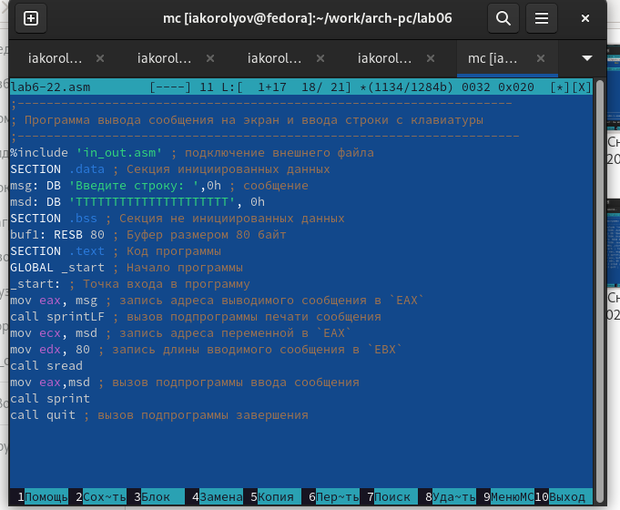

---
## Front matter
title: "Лабораторная работа №6.Основы работы с Midnight Commander (mc).Структура программы на языке ассемблера NASM. Системные вызовы в ОС GNU Linux"
author: "Королёв Иван Андреевич"

## Generic otions
lang: ru-RU
toc-title: "Содержание"

## Bibliography
bibliography: bib/cite.bib
csl: pandoc/csl/gost-r-7-0-5-2008-numeric.csl

## Pdf output format
toc: true # Table of contents
toc-depth: 2
lof: true # List of figures
lot: true # List of tables
fontsize: 12pt
linestretch: 1.5
papersize: a4
documentclass: scrreprt
## I18n polyglossia
polyglossia-lang:
  name: russian
  options:
	- spelling=modern
	- babelshorthands=true
polyglossia-otherlangs:
  name: english
## I18n babel
babel-lang: russian
babel-otherlangs: english
## Fonts
mainfont: PT Serif
romanfont: PT Serif
sansfont: PT Sans
monofont: PT Mono
mainfontoptions: Ligatures=TeX
romanfontoptions: Ligatures=TeX
sansfontoptions: Ligatures=TeX,Scale=MatchLowercase
monofontoptions: Scale=MatchLowercase,Scale=0.9
## Biblatex
biblatex: true
biblio-style: "gost-numeric"
biblatexoptions:
  - parentracker=true
  - backend=biber
  - hyperref=auto
  - language=auto
  - autolang=other*
  - citestyle=gost-numeric
## Pandoc-crossref LaTeX customization
figureTitle: "Рис."
tableTitle: "Таблица"
listingTitle: "Листинг"
lofTitle: "Список иллюстраций"
lotTitle: "Список таблиц"
lolTitle: "Листинги"
## Misc options
indent: true
header-includes:
  - \usepackage{indentfirst}
  - \usepackage{float} # keep figures where there are in the text
  - \floatplacement{figure}{H} # keep figures where there are in the text
---

# Цель работы

Приобретение практических навыков работы в Midnight Commander.Освоение инструкций языка ассемблера mov и int.

# Теоретическое введение

1. Основы работы с Midnight Commander

Midnight Commander (или просто mc) — это программа, которая позволяет просматривать структуру каталогов и выполнять основные операции по управ- лению файловой системой,т.е. mc является файловым менеджером. Midnight Commander позволяет сделать работу с файлами более удобной и наглядной.
Для активации оболочки Midnight Commanderдостаточно ввести в командной строке mc и нажать клавишу Enter.В Midnight Commander используются функциональные клавиши F1 — F10 , к которым привязаны часто выполняемые операции.

2. Структура программы на языке ассемблера NASM

Программа на языке ассемблера NASM, как правило, состоит из трёх секций: секция кода программы (SECTION .text), секция инициированных (известных во время компиляции) данных (SECTION .data) и секция неинициализирован- ных данных (тех, под которые во время компиляции только отводится память, а значение присваивается в ходе выполнения программы) (SECTION .bss). Таким образом, общая структура программы имеет следующий вид:
SECTION .data ; Секция содержит переменные, для
... ; которых задано начальное значение
SECTION .bss ; Секция содержит переменные, для
... ; которых не задано начальное значение
SECTION .text ; Секция содержит код программы
GLOBAL _start
_start: ; Точка входа в программу
... ; Текст программы
mov eax,1 ; Системный вызов для выхода (sys_exit)
mov ebx,0 ; Выход с кодом возврата 0 (без ошибок)
int 80h ; Вызов ядра
Для объявления инициированных данных в секции .data используются ди- рективы DB, DW, DD, DQ и DT, которые резервируют память и указывают, какие значения должны храниться в этой памяти:
* DB (define byte) — определяет переменную размером в 1 байт;
* DW (define word) — определяет переменную размеров в 2 байта (слово);
* DD (define double word) — определяет переменную размером в 4 байта (двойное слово); 
* DQ (define quad word)—определяет переменную размером в 8 байт (учетве- рённое слово); 
* DT (define ten bytes) — определяет переменную размером в 10 байт.
Директивы используются для объявления простых переменных и для объяв- ления массивов. Для определения строк принято использовать директиву DB в связи с особенностями хранения данных в оперативной памяти.Для объявления неинициированных данных в секции .bss используются ди- рективы resb, resw, resd и другие, которые сообщают ассемблеру, что необ- ходимо зарезервировать заданное количество ячеек памяти.

3. Элементы программирования
* Описание инструкции mov
Инструкция языка ассемблера mov предназначена для дублирования данных источника в приёмнике. В общем виде эта инструкция записывается в виде
mov dst,src
Здесь операнд dst — приёмник, а src — источник. В качестве операнда могут выступать регистры (register), ячейки памяти (memory) и непосредственные значения (const). ВАЖНО! Переслать значение из одной ячейки памяти в другую нельзя,для этого необходимо использовать две инструкции mov:
mov eax, x
mov y, eax
Также необходимо учитыватьто,что размер операндов приемника и источни- ка должны совпадать. Использование слудующих примеров приведет к ошибке:
* mov al,1000h — ошибка, попытка записать 2-байтное число в 1-байтный регистр; 
* mov eax,cx — ошибка, размеры операндов не совпадают.
* Описание инструкции int
Инструкция языка ассемблера intпредназначена для вызова прерывания с указанным номером. В общем виде она записывается в виде
int n
Здесь n — номер прерывания, принадлежащий диапазону 0–255. При программировании в Linux с использованием вызовов ядра sys_calls n=80h (принято задавать в шестнадцатеричной системе счисления). После вызова инструкции int 80h выполняется системный вызов какой-либо функции ядра Linux. При этом происходит передача управления ядру опера- ционной системы. Чтобы узнать, какую именно системную функцию нужно выполнить, ядро извлекает номер системного вызова из регистра eax. Поэто- му перед вызовом прерывания необходимо поместить в этот регистр нужный номер. Кроме того, многим системным функциям требуется передавать какие- либопараметры.ПопринятымвОСLinuxправиламэтипараметрыпомещаются в порядке следования в остальные регистры процессора: ebx, ecx, edx. Если си- стемная функция должна вернуть значение, то она помещает его в регистр eax.
* Системные вызовы для обеспечения диалога с пользователем
Простейший диалог с пользователем требует наличия двух функций — выво- да текста на экран и ввода текста с клавиатуры. Простейший способ вывести строку на экран—использовать системный вызов write.Этот системный вызов имеет номер 4, поэтому перед вызовом инструкции int необходимо поместить значение 4 в регистр eax. Первым аргументом write, помещаемым в регистр ebx, задаётся дескриптор файла. Для вывода на экран в качестве дескриптора файла нужно указать 1 (это означает «стандартный вывод»,т.е.вывод на экран). Вторым аргументом задаётся адрес выводимой строки (помещаем его в регистр ecx, например, инструкцией mov ecx, msg). Строка может иметь любую длину. Последним аргументом (т.е. в регистре edx) должна задаваться максимальная длина выводимой строки.
Для ввода строки с клавиатуры можно использовать аналогичный системный вызов read. Его аргументы –такие же, как у вызова write,только для «чтения» с клавиатуры используется файловый дескриптор 0 (стандартный ввод).
Системный вызов exit является обязательным в конце любой программы на языке ассемблер. Для обозначения конца программы перед вызовом инструк- ции int 80h необходимо поместить в регистр еах значение 1, а в регистр ebx код завершения 0.
 
# Выполнение лабораторной работы

1. Открываю mc.Перейду в каталог ~/work/arch- pc созданный при выполнении лабораторной работы №5[-@fig:001]

{ #fig:001 width=70% }

2. С помощью функциональной клавиши F7 создаю папку lab06 и перейду в созданный каталог.[-@fig:002]

{ #fig:002 width=70% }

3. Пользуясь строкой ввода и командой touch создаю файл lab6-1.asm [-@fig:003]

{ #fig:003 width=70% }

4. С помощью функциональной клавиши F4 открою файл lab6-1.asm.Введу текст программы из листинга 6.1 сохраню изменения и закрою файл.[-@fig:004]

{ #fig:004 width=70% }

5. Оттранслирую текст программы lab6-1.asm в объектный файл. Выполню компоновку объектного файла и запущу получившийся исполняемый файл.[-@fig:005]

{ #fig:005 width=70% }

6.  Скачаю файл in_out.asm со страницы курса в ТУИС.Скопирую файл in_out.asm в каталог с файлом lab6-1.asm с помощью функциональной клавиши F5 [-@fig:006]

{ #fig:006 width=70% }

7. С помощью функциональной клавиши F6 создаю копию файла lab6- 1.asm с именем lab6-2.asm.Выделю файл lab6-1.asm,нажму клавишу F6 , введу имя файла lab6-2.asm и нажму клавишу Enter [-@fig:007]

{ #fig:007 width=70% }

8. В файле lab6-2.asm заменю подпрограмму sprintLF на sprint. Создам исполняемый файл и проверю его работу. Происходит переход на новую строку [-@fig:008]

{ #fig:008 width=70% }

# Задание для самостоятельной работы

1. Создаю копию файла lab6-1.asm. Внесу изменения в программу (без использования внешнего файла in_out.asm),так чтобы она работала по алгоритму.[-@fig:009],[-@fig:010]

{ #fig:009 width=70% }

{ #fig:010 width=70% }

2. Создаю копию файла lab6-2.asm. Внесу изменения в программу c использования внешнего файла in_out.asm,так чтобы она работала по алгоритму.[-@fig:011],[-@fig:012]

{ #fig:011 width=70% }

{ #fig:012 width=70% }

# Выводы

Я приобрел практические навыки работы в Midnight Commander. Освоение инструкций языка ассемблера mov и int.

