---
## Front matter
title: "Отчёт по лабораторной работе №7.Арифметические операции в NASM."
author: "Королёв Иван Андреевич"

## Generic otions
lang: ru-RU
toc-title: "Содержание"

## Bibliography
bibliography: bib/cite.bib
csl: pandoc/csl/gost-r-7-0-5-2008-numeric.csl

## Pdf output format
toc: true # Table of contents
toc-depth: 2
lof: true # List of figures
lot: true # List of tables
fontsize: 12pt
linestretch: 1.5
papersize: a4
documentclass: scrreprt
## I18n polyglossia
polyglossia-lang:
  name: russian
  options:
	- spelling=modern
	- babelshorthands=true
polyglossia-otherlangs:
  name: english
## I18n babel
babel-lang: russian
babel-otherlangs: english
## Fonts
mainfont: PT Serif
romanfont: PT Serif
sansfont: PT Sans
monofont: PT Mono
mainfontoptions: Ligatures=TeX
romanfontoptions: Ligatures=TeX
sansfontoptions: Ligatures=TeX,Scale=MatchLowercase
monofontoptions: Scale=MatchLowercase,Scale=0.9
## Biblatex
biblatex: true
biblio-style: "gost-numeric"
biblatexoptions:
  - parentracker=true
  - backend=biber
  - hyperref=auto
  - language=auto
  - autolang=other*
  - citestyle=gost-numeric
## Pandoc-crossref LaTeX customization
figureTitle: "Рис."
tableTitle: "Таблица"
listingTitle: "Листинг"
lofTitle: "Список иллюстраций"
lotTitle: "Список таблиц"
lolTitle: "Листинги"
## Misc options
indent: true
header-includes:
  - \usepackage{indentfirst}
  - \usepackage{float} # keep figures where there are in the text
  - \floatplacement{figure}{H} # keep figures where there are in the text
---

# Цель работы

Освоение арифметических инструкций языка ассемблера NASM.

# Теоретическое введение

1. Адресация в NASM

Большинство инструкций на языке ассемблера требуют обработки операндов. Адрес операнда предоставляет место, где хранятся данные, подлежащие обра- ботке.Этомогутбытьданныехранящиесяврегистреиливячейкепамяти.Далее рассмотрены все существующие способы задания адреса хранения операндов – способы адресации. Существуеттри основных способа адресации:

* Регистровая адресация – операнды хранятся в регистрах и в команде используются имена этих регистров, например: mov ax,bx.
* Непосредственная адресация – значение операнда задается непосред- ственно в команде, Например: mov ax,2. 
* Адресация памяти–операндзадаетадресвпамяти.Вкомандеуказывает- ся символическое обозначение ячейки памяти, над содержимым которой требуется выполнить операцию

Например, определим переменную intg DD 3 – это означает, что задается область памяти размером 4 байта, адрес которой обозначен меткой intg. В таком случае, команда
mov eax,[intg]
копирует из памяти по адресу intg данные в регистр eax. В свою очередь команда
mov [intg],eax
запишет в память по адресу intg данные из регистра eax. Также рассмотрим команду
mov eax,intg
В этом случае в регистр eax запишется адрес intg. Допустим,для intg выде- лена память начиная с ячейки с адресом 0x600144,тогда команда mov eax,intg аналогична команде mov eax,0x600144 – т.е. эта команда запишет в регистр eax число 0x600144.

# Выполнение лабораторной работы

# Символьные и численные данные в NASM

1. Создаю каталог для программам лабораторной работы № 7, перейду в него и создам файл lab7-1.asm:

2. Рассмотрим примеры программ вывода символьных и численных значе- ний. Программы будут выводить значения записанные в регистр eax.Листинг 7.1[-@fig:001],[-@fig:002]

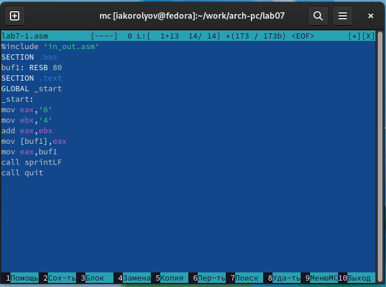{ #fig:001 width=70% }

{ #fig:002 width=70% }

3. Далее изменим текст программы и вместо символов, запишем в реги- стры числа. Исправьте текст программы (Листинг 1) следующим образом. Не отображается[-@fig:003],[-@fig:004]

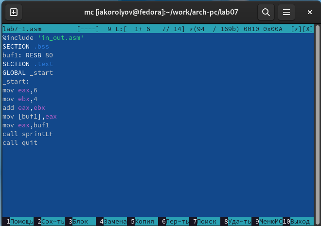{ #fig:003 width=70% }

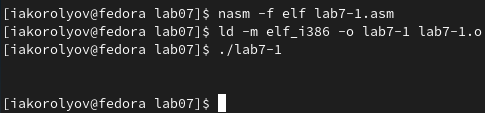{ #fig:004 width=70% }

4. Создаю файл lab7-2.asm в каталоге ~/work/arch-pc/lab07 и введу в него текст программы из листинга 7.2.[-@fig:005],[-@fig:006]

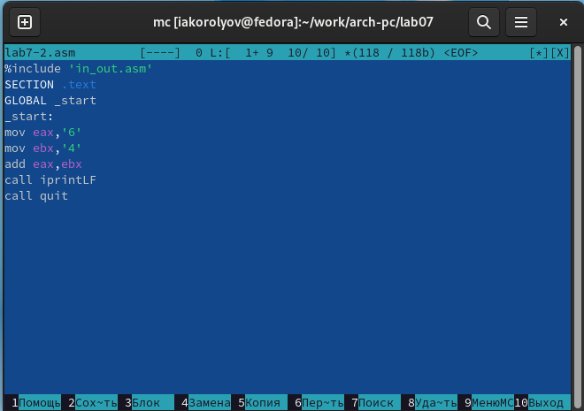{ #fig:005 width=70% }

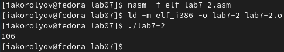{ #fig:006 width=70% }

5. Аналогично предыдущему примеру изменим символы на числа. Замените строки. Не переходит на новую строку.[-@fig:007],[-@fig:008]

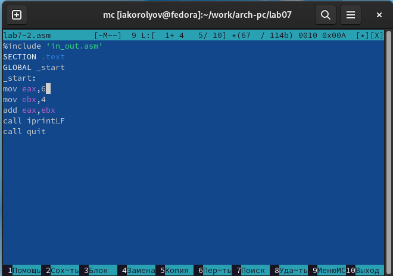{ #fig:007 width=70% }

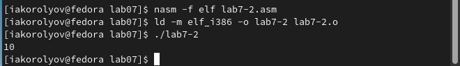{ #fig:008 width=70% }

# Выполнение арифметических операций в NASM

6. В качестве примера выполнения арифметических операций в NASM при- ведем программу вычисления арифметического выражения. [-@fig:009],[-@fig:010],[-@fig:011],[-@fig:012]
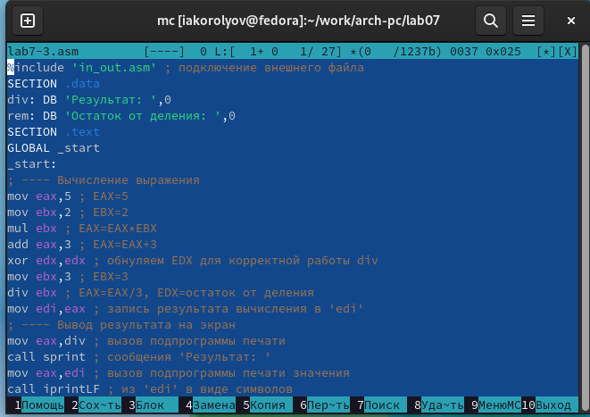{ #fig:009 width=70% }

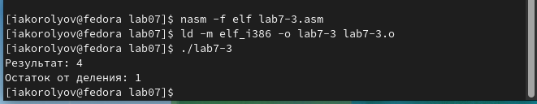{ #fig:010 width=70% }

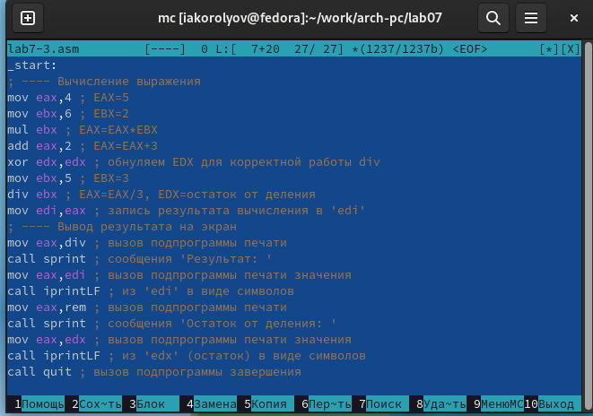{ #fig:011 width=70% }

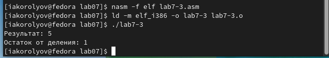{ #fig:012 width=70% }

7. В качестве другого примера рассмотрим программу вычисления варианта задания по номеру студенческого билета, работающую по следующему алгоритму[-@fig:013],[-@fig:014]

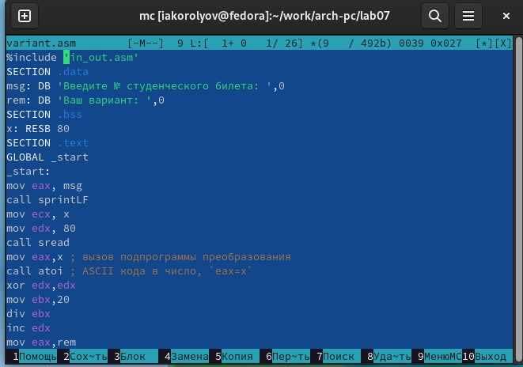{ #fig:013 width=70% }

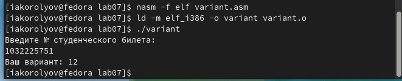{ #fig:014 width=70% }

Ответы на вопросы:

1.mov eax,rem
call sprint

2.Ввод переменной x

3.Преобразует строку string в целое значение типа int.

4.xor edx,edx
mov ebx,20
div ebx
inc edx

5.В mov edi,eax

6.inc уеличивает на 1 свой операнд

7.mov eax,edx
call iprintLF

8. Самостоятельная работа:[-@fig:015],[-@fig:016]

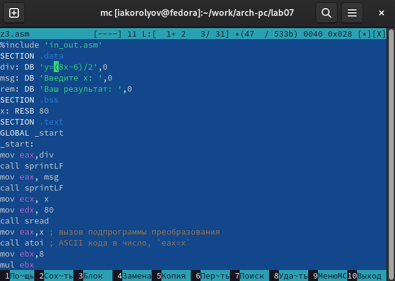{ #fig:015 width=70% }

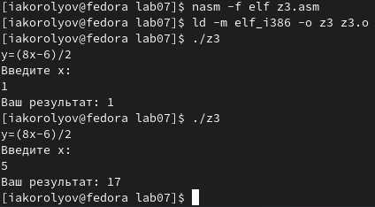{ #fig:016 width=70% }

# Выводы

Я освоил арифметические инструкций языка ассемблера NASM.

